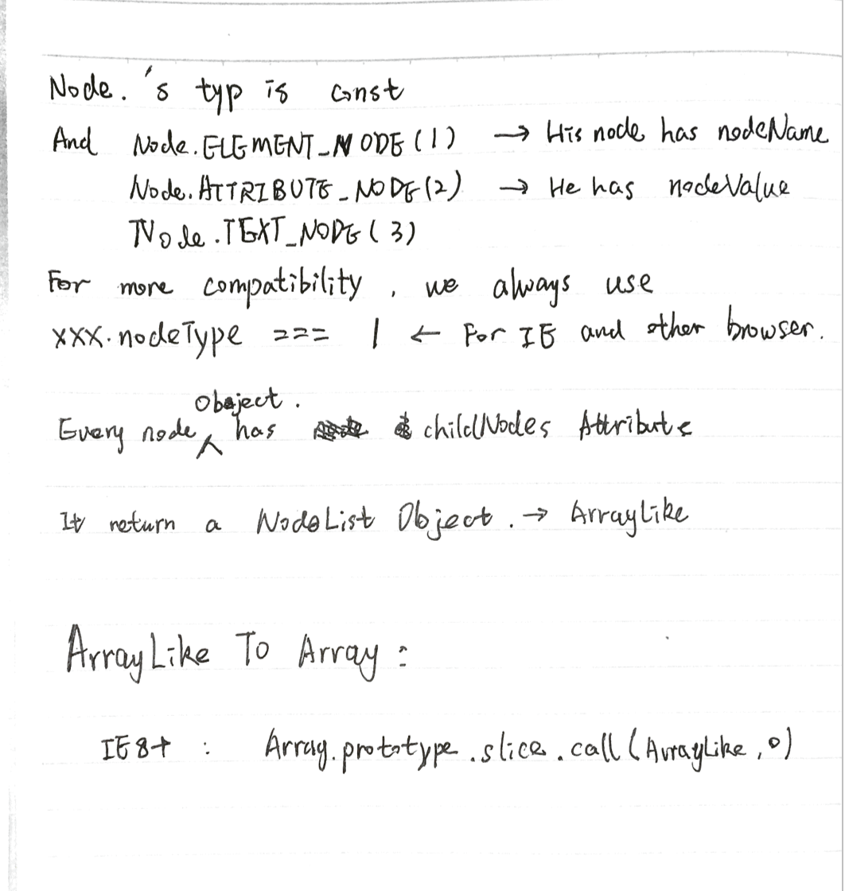
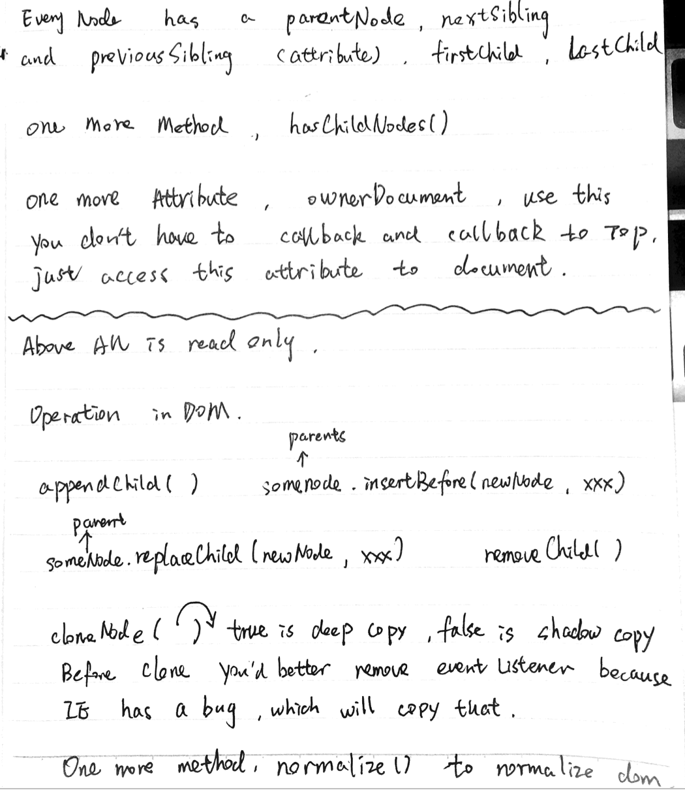

* [HTML](#html)
  * ##link and @import
  * [Solve new html5 tag browser compatitable](#solve-new-html5-tag-browser-compatitable)
  * [[解决HTML5新标签的浏览器兼容问题|解决HTML5新标签的浏览器兼容问题]]
  * iframe常用使用场景与iframe的通信
  * [cookies，sessionStorage 和 localStorage](#storage)
  * [同源策略](#origin)
  * [解决跨域](#crossdomain)
  
* [CSS](#css)
  * [我常用的垂直水平居中(注意整体布局)](#middlelayout)
  * [常用的清除浮动](#clearfloat)
  * [css hack](#csshack)

* [JS](#js)
  * [闭包](#clojure)
  * [difference between function declaration and anonymous function](#functionhoisting)
  * [$(document).ready和window.onload的区别](#ready)
  * [用原生实现get和post](#nativeajax)
  * [类数组转化为真实数组的实现](#arryliketoarray)
  * [数组去重](#distinctarray)
  * [将嵌套的js数组转化为一维数组的办法](#recursivearray)
  * [对象类型的精确判断](#precise_judge_type)
  * [JS 操作dom的原生操作](#JS_dom)
  * [常用字符串操作](#useful_string_operation)
  * [常用数组操作](#useful_array_operation)
  * [常用数字操作](#useful_math_operation)
  * [regular expression](./regular_expression.md)
* [计算机网络](#network)
  * [HTTP请求状态码](#httpcode)

* [网络安全](#network_security)
  * [CSRF](#csrf)
  * [XSS](#xss)

##HTML


###link and @import

link是HTML标签，@import是css定义的引用依赖的标志。

###解决HTML5新标签的浏览器兼容问题

HTML5shive

###iframe常用使用场景与iframe的通信

###cookies，sessionStorage 和 localStorage

###同源策略

协议（protocol），端口（如果指定），和主机都要相同

####解决跨域

Jsonp:  
通过script标签，callback后运行指定函数，并传入数据。  
Json由两部分组成，回调函数和数据。
带着数据运行回调。

图片打点：
img.src

CORS:

CORS主要是能做网站白名单过滤，通过设置Access-control-Allow-Origin，
在响应报头中，告诉浏览器这个，网站授信

iframe也可以跨域
通信方式，postmessage + window.navigator 的兼容


##CSS

###我常用的垂直水平居中（注意整体布局）

第一种：width都确定 `margin: 0 auto` (水平居中)

第二种：内层absolute，外侧relative的 负margin法

第三种：牛逼的transform

第四种：牛逼的table

###常用的清除浮动

第一种：插入额外dom clear：both；

第二种：

```css
.clearfix{
	zoom:1
}
.clearfix:after { 
   content: "."; 
   visibility: hidden; 
   display: block; 
   height: 0; 
   clear: both;
}
```

###css hack
Attribute Hack
```css
/* IE6 */
#once { _color: blue }
/* IE6, IE7 */
#doce { *color: blue; /* or #color: blue */ }
/* IE6, IE7, IE8, but also IE9 in some cases :( */
#diecinueve { color: blue\9; }
/* IE8, IE9 */
#anotherone  {color: blue\0/;} /* must go at the END of all rules */
```

##Javascript

###闭包

###difference between function declaration and anonymous function

Function declaration has hoisting , but anonymous function not.


###$(document).ready和window.onload的区别
**手写一个ready函数**

```javascript
document.ready = function(callback) {
  if (document.addEventListener) {
      document.addEventListener("DOMContentLoaded",function(){
        document.removeEventListener("DOMContentLoaded", arguments.callee , false);
        callback()
      })     
  } else if (document.attachEvent){ //compatible for oldIE
    document.attachEvent('onreadystatechange',function(){
      if (document.readyState == "complete") {
        document.detachEvent("onreadystatechange", arguments.callee);
        callback();
      }
    })
  }
}
```

###用原生实现get和post
```javascript
function createXHR() {
  if (typeof XMLHttpRequest != "undefined") {
    return new XMLHttpRequest();
  } else if (typeof ActiveXObject != "undefined") {
    if (typeof arguments.callee.activeXString != "string") {
      var versions = ["MSXML2.XMLHttp.6.0", "MSXML2.XMLHttp.3.0", i, len;
          "MSXML2.XMLHttp"
        ],
        for (i = 0, len = versions.length; i < len; i++) {
          try {
            new ActiveXObject(versions[i]);
            arguments.callee.activeXString = versions[i];
            break;
          } catch (ex) {
            //􏹸􏹹 }
          }
        }
      return new ActiveXObject(arguments.callee.activeXString);
    } else {
      throw new Error("No XHR object available.");
    }
  }
}

var xhr = createXHR();
xhr.onreadystatechange = function(){
  if(xhr.readyState === 4){
    if((xhr.status >= 200 && xhr < 300) || xhr.status  == 304){
      alert(xhr.responseText);
    }else{
      alert("something is wrong " + xhr.status);
    }
  }
}
xhr.open('get',url,true);
xhr.send(null); //null 是必须的，这里模拟的是get请求
```

###类数组转化为真实数组的实现
http://segmentfault.com/a/1190000000415572

```javascript
function convertToArray(){
  var nodes = arguments[0],array = [];
  try {
    array = Array.prototype.slice(nodes,0);
  } catch (ex) {
    for (var i=0, len=nodes.length; i < len; i++){
      array.push(nodes[i]);
    }
  }
  return array;
}
```


###数组去重

hashmap
```javascript

Array.prototype.distinct = function(){
  var cache=[],i,result = [];
  //note: this is arrayLike Object
  for(i=0;i < this.length;i++){
    if(!cache[this[i]]){
      cache[this[i]] = true;
      result.push(this[i]);
    }
  }
  return result;
}

```

###用事件代理，给每一个li添加删除button

###将嵌套的js数组转化为一维数组的办法

```javascript

var plainArr = (function(arr){
  var result = [];

  function plainArrUtil(){
    var i = 0,arr = arguments[0];

    for(i = 0;i < arr.length;i++){
      if(arr[i] instanceof Array){
        plainArr(arr[i]);
      }else{
        result.push(arr[i]);
      }
    }
  }

  plainArrUtil(arr);

  return result;
});

```

递归调用

###对象类型的精确判断
```javascript
var class2type = {};
"Boolean Number String Function Array Date RegExp Object".split(' ').forEach(function(name, index){
  class2type[ "[object " + name + "]" ] = name.toLowerCase();
})
var type = function(){
  var o = arguments[0];
  var type = Object.prototype.toString.call(o);
  return class2type[type]
}
```
###JS 操作dom的原生操作



###常用字符串操作
####字符方法
`charAt()`

####字符操作方法
`concat()`
`slice()`
> slice接收两个参数，起始位（计算在内），截止位（不算在内）
`substr()`
> substr接收两个参数，起始位（计算在内），截取字符数目
`substring()`
> substring接收两个参数，起始位（计算在内），截止位（不算在内）

####字符定位方法
`indexOf("")`

`lastIndexOf("")`

> 一个是从前往后，另一个是从后往前，序号都是从前往后排，第二个参数可以接收开始位置

####字符串的模式匹配方法
[regular expression](./regular_expression.md)  

###常用数组操作
####栈方法
push pop
unshift shift
####操作方法
`slice()` 从起点到终点（不算）切下来
`splice()` 接收n个参数，从哪切，切多少，插入不？

####Iterative method
**ECMAscript5 method:**  
> /* parma: item , index*/  
> *every()*: If everyone return true , the result is true.  
> *filter()*: Return the array which is consist of the item return true.  
> *forEach()*:  Run function for every item , no return.  
> *map()*:  Run function for every item , and make a array with return value.   
> *some()*:  any function return true , and the result is true.  

###常用数字操作

###正则表达式（匹配和方法）

[regular expression](./regular_expression.md)  

##计算机网络

###HTTP请求状态码
> 200 OK  
301 永久重定向  
302 暂时重定向 （和301的本质区别在哪）  
304 Not Modified  
400 Bad Request  
401 Unauthorized  
403 Forbidden  
404 Not Found  

##网路安全

###CSRF
http://www.cnblogs.com/hyddd/archive/2009/04/09/1432744.html
http://www.ibm.com/developerworks/cn/web/1102_niugang_csrf/

###XSS

