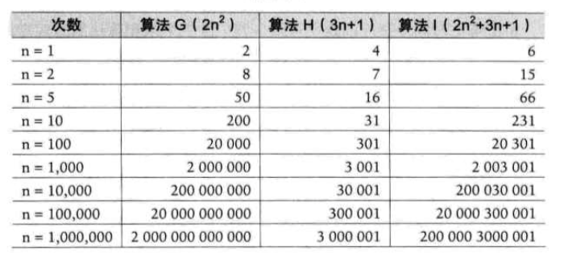

###算法复杂度的计算标准

判断一个算法好不好，少量数据是无法证明的，在大量数据的情景下
除最高阶的数据外，其他几乎可以忽略不计

####常数阶
对于分支结构，不管有多少分支，或者有没有分支
算法时间复杂度都为O(1)

####线性阶
循环体中的代码需要运行n次，所以时间复杂度为O(n)

####对数阶
对数阶，什么是对数呢，增长趋势越来越快，或越来越慢，非线性增长
O(logn)

####平方阶
内嵌套循环 O(n^2)

###栈与递归

####invert binary trees

####Fibonacci

####四则运算的表达式求值

###队列，循环队列

###串，朴素匹配与KMP匹配

